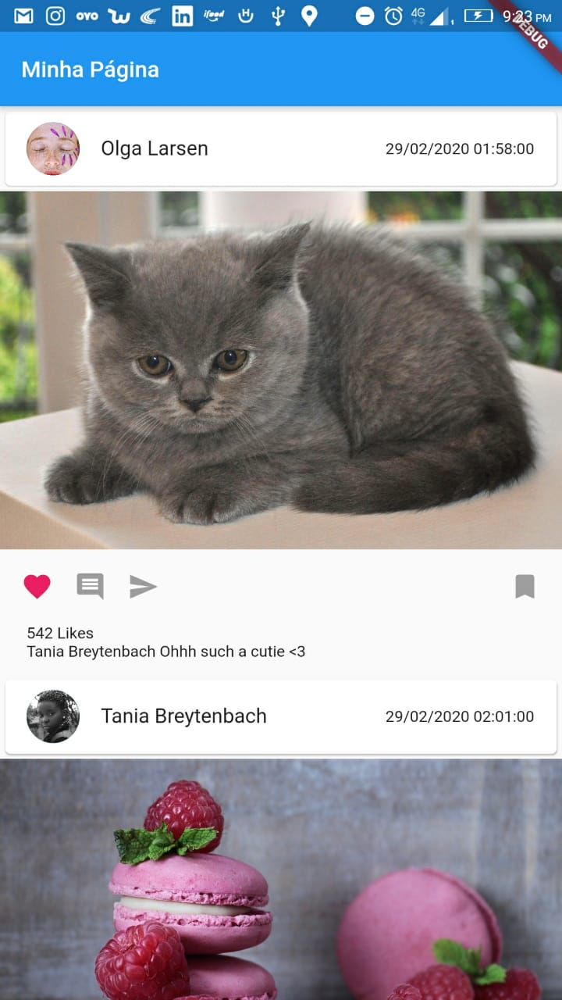

# flutterapp

App Minha Página

## Sobre o app

O app é uma forma fácil de obter dados de um servidor 
e exibir em um ListView.Builder

## Api Rest
Para se comunicar com a API e obter um retorno GET

**nossa classe Rest**

    const urlApi = "https://mobile.int.granito.xyz/api/feed/getposts";

    import 'package:http/http.dart' as http;
    class Rest {
      static Future getData() async {
        var url = urlApi;
        return await http.get(url);
      }
    }

**as constants podem ficar em outra classe**

    class Constants {
    
      static final String IMAGE_ASSET_URL = 'assets/notfound.png';
    
    }

**mapeamos o nosso retorno do json**

    class Response {
      int postId;
      int personId;
      String created;
      String photoUri;
      int likes;
      Person person;
      List<Comments> comments;
    
      Response(
          {this.postId,
            this.personId,
            this.created,
            this.photoUri,
            this.likes,
            this.person,
            this.comments});
    
      Response.fromJson(Map<String, dynamic> json) {
        postId = json['postId'];
        personId = json['personId'];
        created = json['created'];
        photoUri = json['photoUri'];
        likes = json['likes'];
        person =
        json['person'] != null ? new Person.fromJson(json['person']) : null;
        if (json['comments'] != null) {
          comments = new List<Comments>();
          json['comments'].forEach((v) {
            comments.add(new Comments.fromJson(v));
          });
        }
      }
    }
    
    class Person {
      int personId;
      String name;
      String profilePhotoUri;
    
      Person({this.personId, this.name, this.profilePhotoUri});
    
      Person.fromJson(Map<String, dynamic> json) {
        personId = json['personId'];
        name = json['name'];
        profilePhotoUri = json['profilePhotoUri'];
      }
    }
    
    class Comments {
      int commentId;
      int postId;
      int personId;
      Person person;
      String text;
    
      Comments(
          {this.commentId, this.postId, this.personId, this.person, this.text});
    
      Comments.fromJson(Map<String, dynamic> json) {
        commentId = json['commentId'];
        postId = json['postId'];
        personId = json['personId'];
        person =
        json['person'] != null ? new Person.fromJson(json['person']) : null;
        text = json['text'];
      }
    }

**por final temos a nssa main.dart**
aqui nos importamos a nossa chamada a api e reponse e montamos o listview

    import 'dart:convert';
    
    import 'package:date_format/date_format.dart';
    import 'package:flutter/material.dart';
    import 'package:flutterapp2/response/response.dart';
    import 'package:flutterapp2/utils/constants.dart';
    import 'package:flutterapp2/webservice/rest.dart';
    
    void main() => runApp(MyApp());
    
    class MyApp extends StatelessWidget {
      @override
      Widget build(BuildContext context) {
        return MaterialApp(
          title: 'Feed',
          theme: ThemeData(
            primarySwatch: Colors.blue,
          ),
          home: MyHomePage(title: 'Minha Página'),
        );
      }
    }
    
    class MyHomePage extends StatefulWidget {
      MyHomePage({Key key, this.title}) : super(key: key);
    
      final String title;
    
      @override
      _MyHomePageState createState() => _MyHomePageState();
    }
    
    class _MyHomePageState extends State<MyHomePage> {
      var response = new List<Response>();
    
      _getData() {
        Rest.getData().then((data) {
          setState(() {
            Iterable list = json.decode(data.body);
            response = list.map((model) => Response.fromJson(model)).toList();
          });
        });
      }
    
      _MyHomePageState() {
        _getData();
      }
    
      @override
      Widget build(BuildContext context) {
        return Scaffold(
            appBar: AppBar(
              title: Text(widget.title),
            ),
            body: ListView.builder(
              itemCount: response.length,
              itemBuilder: listTile,
            ));
      }
    
      String convertDateFromString(String strDate) {
        DateTime todayDate = DateTime.parse(strDate);
        return (formatDate(
            todayDate, [dd, '/', mm, '/', yyyy, ' ', hh, ':', nn, ':', ss]));
      }
    
      Column listTile(BuildContext context, int index) {
        return Column(
          children: <Widget>[
            Card(
                child: Column(
              children: <Widget>[
                ListTile(
                  leading: CircleAvatar(
                      radius: 20,
                      backgroundImage:
                          NetworkImage(response[index].person.profilePhotoUri)),
                  title: Text(response[index].person.name,
                      style: TextStyle(fontSize: 18)),
                  trailing:
                      Text(this.convertDateFromString(response[index].created)),
                ),
              ],
            )),
            Column(
              children: <Widget>[
                response[index].photoUri == null
                    ? Image.asset(Constants.IMAGE_ASSET_URL)
                    : Image.network(response[index].photoUri)
              ],
            ),
            Padding(
              padding: const EdgeInsets.all(16.0),
              child: Row(
                mainAxisAlignment: MainAxisAlignment.spaceBetween,
                children: <Widget>[
                  new Row(
                    mainAxisAlignment: MainAxisAlignment.spaceBetween,
                    children: <Widget>[
                      new Icon(
                        Icons.favorite,
                        color: Colors.pink,
                        size: 24.0,
                        semanticLabel: 'Text to announce in accessibility modes',
                      ),
                      new SizedBox(
                        width: 16.0,
                      ),
                      new Icon(
                        Icons.comment,
                        color: Colors.grey,
                        size: 24.0,
                        semanticLabel: 'Text to announce in accessibility modes',
                      ),
                      new SizedBox(
                        width: 16.0,
                      ),
                      new Icon(
                        Icons.send,
                        color: Colors.grey,
                        size: 24.0,
                        semanticLabel: 'Text to announce in accessibility modes',
                      )
                    ],
                  ),
                  new Icon(
                    Icons.turned_in,
                    color: Colors.grey,
                    size: 24.0,
                    semanticLabel: 'Text to announce in accessibility modes',
                  )
                ],
              ),
            ),
            Padding(
              child: Row(
                children: <Widget>[
                  Text(response[index].likes.toString() + " Likes")
                ],
              ),
              padding: EdgeInsets.fromLTRB(20, 0, 0, 0),
            ),
            Padding(
              child: Row(
                children: <Widget>[
                  Text(response[index].comments.length != 0
                      ? response[index].comments[0].person.name.toString() +
                          " " +
                          response[index].comments[0].text
                      : "")
                ],
              ),
              padding: EdgeInsets.fromLTRB(20, 0, 0, 10),
            ),
          ],
        );
      }
    }
    

## libs utilizadas
Podemos importar no arquivo **pubspec.yaml **do projeto em **dependencies**:
`  date_format: "^1.0.4"`
  `http: ^0.12.0+4`

para converter a data 

## img

